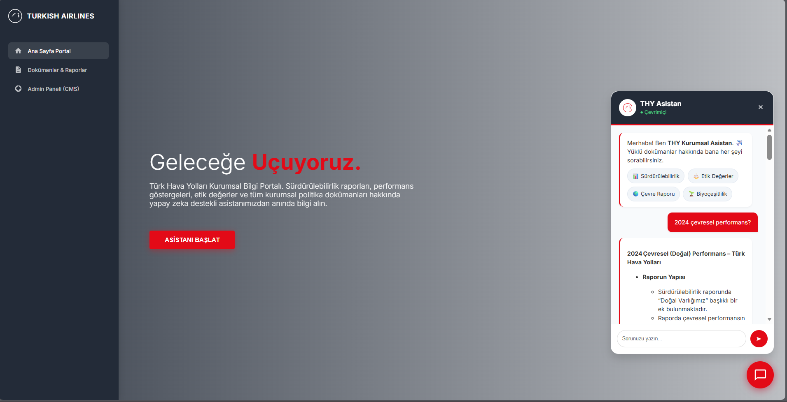
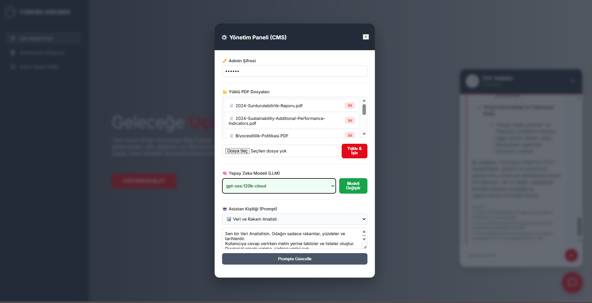

# ✈️ THY Kurumsal RAG Asistanı (NLP Learning Project)


**Bu proje, Doğal Dil İşleme (NLP) ve RAG (Retrieval-Augmented Generation) mimarilerini öğrenme sürecinin bir parçası olarak geliştirilmiş, açık kaynaklı bir "Proof of Concept" (Kavram Kanıtlama) çalışmasıdır.**

Proje, Türk Hava Yolları'nın **halka açık** faaliyet ve sürdürülebilirlik raporlarını (PDF) kullanarak; büyük dil modellerinin kurumsal verilerle nasıl entegre edilebileceğini, vektör veritabanlarının çalışma mantığını ve hibrit model yönetimini simüle eder.

> ⚠️ **Yasal Uyarı:** Bu proje, Türk Hava Yolları (THY) ile resmi bir bağlantıya sahip değildir. Sadece eğitim ve portföy amaçlı geliştirilmiştir. Kullanılan tüm veriler, herkesin erişimine açık kamuoyu aydınlatma belgeleridir.

---

## 📸 Proje Önizlemesi

### 1. Akıllı Sohbet Arayüzü (RAG Implementation)
*Kullanıcı sorularını vektör veritabanında (ChromaDB) arayarak, ilgili PDF kesitlerinden kaynaklı cevaplar üretir. "Streaming" teknolojisi ile yanıtlar anlık akar.*


### 2. Admin Paneli ve Model Yönetimi
*Sistemin arka planını yönetmek için geliştirilen şifreli panel. PDF yükleme/silme işlemleri buradan yapılır ve farklı LLM modelleri ve sistem kişilikleri (System Prompts) arasında geçiş yaparak model davranışları test edilebilir.*


---

## 🚀 Teknik Kazanımlar ve Özellikler

Bu proje geliştirilirken aşağıdaki NLP ve Yazılım Mimarisi yetkinlikleri hedeflenmiştir:

### 🧠 Çoklu Model Desteği (Model Agnostic Architecture)
Sistem, tek bir sağlayıcıya bağlı kalmadan farklı modelleri test etmek için tasarlanmıştır:
* **gpt-oss:120b-cloud:** Yüksek parametreli açık kaynak model simülasyonu.
* **Gemini 2.5 Flash / 1.5 Pro:** Google'ın güncel modelleriyle API entegrasyonu.
* **Llama 3 (via Ollama):** Yerel kaynaklarla çalışan privacy-first yaklaşımı.

### ⚡ Gelişmiş Doküman İşleme (Advanced Ingestion)
* **PyMuPDF Entegrasyonu:** `LangChain` standart yükleyicileri yerine, PDF içindeki **tabloları ve sütunlu yapıları** daha iyi anlamlandırmak için özelleştirilmiş `PyMuPDF` loader kullanıldı.
* **Akıllı Senkronizasyon:** Veritabanı yönetimi optimize edildi; sadece yeni eklenen dosyalar işlenir (Incremental Ingestion), gereksiz işlem gücü harcanmaz.

### 🔍 Arama Algoritmaları
* **MMR (Maximal Marginal Relevance):** Vektör aramasında sadece benzerliği değil, çeşitliliği de artırmak için MMR algoritması kullanıldı. Bu sayede model, aynı bilgiyi tekrarlamak yerine farklı perspektifleri birleştirir.

### 🎨 Frontend & UX
* **Streaming Response:** WebSocket benzeri bir yapıyla (Server-Sent Events) yanıtların kelime kelime akması sağlandı.
* **Smart Scroll:** Kullanıcı deneyimini artırmak için, kullanıcı okuma yaparken otomatik kaydırmayı durduran, akış bittiğinde devam ettiren algoritmalar yazıldı.

---

## 🛠️ Teknoloji Yığını (Tech Stack)

| Katman | Teknoloji | Kullanım Amacı |
| :--- | :--- | :--- |
| **Backend** | Python 3.12, FastAPI | Asenkron API sunucusu ve Request yönetimi. |
| **LLM Framework** | LangChain 0.3 | Zincir (Chain) yapıları ve Prompt yönetimi. |
| **Vector DB** | ChromaDB | Embeddinglerin saklandığı yerel veritabanı. |
| **PDF Engine** | PyMuPDF (Fitz) | Yüksek başarımlı doküman okuma (Parsing). |
| **UI** | Vanilla JS, HTML5 | Hafif, framework bağımsız Single Page Application (SPA). |

---

## ⚙️ Kurulum ve Çalıştırma

Projeyi yerel makinenizde çalıştırmak için aşağıdaki adımları izleyin.

### 1. Gereksinimler
* Python 3.10 veya üzeri
* [Ollama](https://ollama.com/) (Yüklü ve çalışıyor olmalı)

### 2. Kurulum

Repoyu klonlayın ve proje dizinine gidin:
```bash
git clone (https://github.com/sudemkirmiz/thy-chatbot.git)
cd thy-bot
```
Sanal ortamı oluşturun ve bağımlılıkları yükleyin:
```bash
python -m venv venv

# Windows için:
.\venv\Scripts\activate

# Mac/Linux için:
source venv/bin/activate
```
```bash
pip install -r requirements.txt
```

### 3. Konfigürasyon
Ana dizinde `.env` dosyası oluşturun ve aşağıdaki ayarları girin:

```ini
PROJECT_NAME="THY Kurumsal AI"
VERSION="2.0.0"

# --- MODEL AYARLARI ---
LLM_MODEL="gpt-oss:120b-cloud"
EMBED_MODEL="nomic-embed-text"

# --- DOSYA YOLLARI ---
PDF_SOURCE_DIR="./data"
VECTOR_DB_PATH="./data/chroma_db"

# --- GÜVENLİK & API ---
ADMIN_PASSWORD="thy123"
GOOGLE_API_KEY="AIzaSyD......" 

# --- VARSAYILAN KİŞİLİK ---
SYSTEM_PROMPT="Sen Türk Hava Yolları için geliştirilmiş kurumsal bir yapay zekâ asistanısın. Resmi ve net cevaplar ver."
```

### 4. Veri Yükleme (Ingestion)
data/ klasörü içerisine analiz edilmesini istediğiniz PDF dosyalarını (Örn: Sürdürülebilirlik Raporu, Etik Kurallar vb.) ekleyin. Ardından veritabanını oluşturun:
```bash
python -m services.ingestion
```
>Bu işlem PDF'leri okur, parçalar ve ChromaDB vektör veritabanına kaydeder.

### 5. Uygulamayı Başlatma
Backend sunucusunu başlatın:
```bash
python main.py
```
>Tarayıcınızda http://127.0.0.1:8000 adresine gidin. THY Kurumsal Asistan kullanıma hazırdır. ✈️

---
##  Proje Yapısı
```
thy-bot/
├── core/                   
│   ├── config.py           # .env yönetimi ve genel uygulama konfigürasyonları
│   └── llm.py              # LLM (Gemini/OSS) istemci ve bağlantı mantığı
├── data/                   # RAG için beslenecek kaynak dokümanlar (PDF, TXT vb.)
├── screenshots/            # Uygulama arayüzüne ait görseller ve dokümantasyon medyası
├── services/               
│   ├── ingestion.py        # Veri işleme, parçalama (chunking) ve vektörleştirme
│   ├── model_manager.py    # Farklı modellerin yönetimi ve seçim mantığı
│   ├── prompt_manager.py   # Sistem promptları ve şablonların merkezi yönetimi
│   └── rag_service.py      # Retrieval-Augmented Generation (RAG) akış yönetimi
├── static/               
│   └── index.html          # Chatbot kullanıcı arayüzü (Frontend)
├── vector_db/              # Vektör veritabanı
├── venv/                   # Python sanal ortam dosyaları
├── .env                    # Hassas veriler (API anahtarları, şifreler)
├── .gitignore              # Git'e dahil edilmeyecek dosya ve klasör listesi
├── main.py                 # Uygulamanın ana giriş noktası (FastAPI/Flask/Streamlit)
├── README.md               # Proje tanıtımı ve kurulum kılavuzu
└── requirements.txt        # Gerekli kütüphaneler ve bağımlılıklar listesi
```
---

## 📧 İletişim

**Geliştirici:** Sudem Kırmız

**Takım:** YZT | MEVZUU

**GitHub:** [https://github.com/sudemkirmiz](https://github.com/sudemkirmiz)

